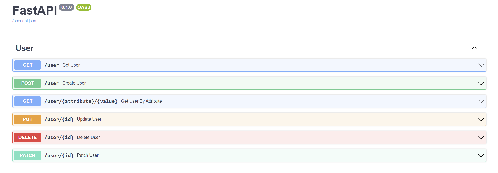

# genroutes

----
Generate CRUD routes for FastAPI projects, reduce boilerplate code, accelerate development of FastAPI backend!


## Description
In order to build a webservice with FastAPI, some sections of code in defining endpoints needs to be repeated.  
Code repetition makes maintenance of such services more difficult.  
genroutes helps address the issue of code repetition and also speeds up development of
FastAPI projects, by allowing the developer to focus development efforts on areas that require creativity.  

In most projects that require interaction with a datasource, CRUD (**C**reate, **R**ead, **U**pdate, **D**elete) endpoints often need to be created to enable
such functionality.
With genroutes, CRUD endpoints can easily be generated for specified data objects in simple steps.

## Installation
####  Prerequisites
genroutes requires these packages in most cases

- fastapi~=0.95.0
- SQLAlchemy~=2.0.7
- pydantic~=1.10.6

Install package with pip:

``pip install git+https://github.com/TokoniK/genroutes@main ``

# Usage
Import Routes & HttpMethods into module
``from genroutes import Routes, HttpMethods``

For instance, say your FastAPI project has an SQLAlchemy schema object ``User``, a pydantic model ``UserEntity``
and a SQLAlchemy session object ``Session``.CRUD routes can be generated using the example below:

**main.py**
```
from fastapi import FastAPI
from genroutes import Routes, HttpMethods
#<import User>
#<import UserEntity>
#<import Session>

app = FastAPI(swagger_ui_parameters={"defaultModelsExpandDepth": -1})

#Create crud routes for User model / UserEntity schema combo
routes = Routes(Session, auth_route='auth')
user_routes = routes.get_router("user", User, UserEntity, UserEntity,
            response_exclude=["password"],
            access_mode=HttpMethods.ALL_METHODS, id_field = 'id')

#Add crud router to app
app.include_router(router=user_routes)
```

Run the app on a web server such as uvicorn:  
```
uvicorn main:app
```

Following this, the openapi docs will look like as seen below:


Routes for all supported methods are created according to the ``access_mode`` param
specified at route generation:
``access_mode=HttpMethods.ALL_METHODS``
